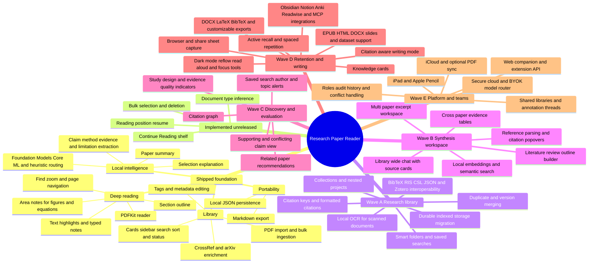
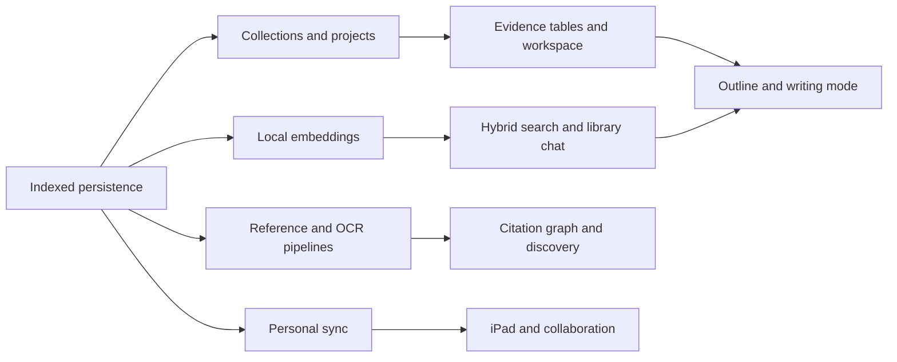

# Product Development Path

This is the living implementation map for Research Paper Reader. It combines the shipped history in [`CHANGELOG.md`](CHANGELOG.md), the product direction in [`research-paper-reader-design.md`](research-paper-reader-design.md), and the competitive feature review completed on 2026-06-19.

## How status is determined

- **Shipped** means the capability is recorded in `CHANGELOG.md`.
- **Implemented, unreleased** means it exists in the current source but has not yet been recorded in a release entry.
- **Partial** means a UI, model, or fallback exists, but the complete user workflow does not.
- **Planned** means implementation work is still required.
- When documents disagree, inspect the current source and tests, then update this file and the changelog together.

## Product mind map

## Reconciled capability status

| Capability | Status | Evidence or remaining gap |
|---|---|---|
| PDF library, reading, annotations, area notes | Shipped | Changelog v0.1.0 through v0.9.1 |
| Metadata enrichment | Shipped | CrossRef, arXiv, heuristic and Foundation Models paths exist |
| Local AI summary, extraction and explanation | Shipped | Local routing and fallbacks exist |
| Document-type-aware summaries | Implemented, unreleased | `DocumentKind` and type inference exist in source |
| Bulk paper deletion | Implemented, unreleased | Selection state and bulk delete action exist in `ContentView` |
| Resume reading | Implemented, unreleased | Reading position, Continue Reading shelf, and preference exist |
| Cloud/BYOK AI | Partial | Settings and provider placeholders exist; secure requests, credentials, consent, errors, and tests do not |
| Collections and projects | Shipped in Unreleased | Nested collections and persistent multi-paper workspaces are implemented |
| Semantic retrieval | Shipped in Unreleased | On-device sentence embeddings with lexical fallback; persistent incremental indexing remains future work |
| OCR | Planned | Embedded PDF text only; scanned PDFs cannot enter the complete search/AI workflow |
| Citation management | Shipped in Unreleased | BibTeX/RIS import/export, citation keys, duplicate merging, and parsed reference graphs are implemented; CSL-JSON remains future work |
| Literature review workspace | Shipped in Unreleased | Evidence tables, source verification, multi-paper outlines, and editable writing drafts are implemented |
| Sync and collaboration | Planned | State is local and single-user |

## Implementation register

Work top to bottom within a wave unless a task is explicitly marked independent. A feature is complete only when its model, persistence, UI, error handling, migration behavior, and tests are present.

### Release hygiene — do first

- [x] **REL-01: Record unreleased features.** Add document types, bulk selection/deletion, Continue Reading, and position resume to the next changelog release.
- [x] **REL-02: Correct roadmap status.** The contradictory local-embeddings marker in the design document now correctly shows that semantic search is not implemented.
- [x] **REL-03: Add feature-state tests.** Cover document kind round trips, reading-position restoration, and bulk deletion cleanup.

### Wave A — research library foundation

- [ ] **LIB-01: Indexed persistence.** Introduce a schema-backed store suitable for collections, references, embeddings, and sync. Migrate existing `library.json` and preserve local PDF/image paths.
- [x] **LIB-02: Collections and projects.** Add nested collections, many-to-many paper membership, collection counts, assignment, and project-scoped workspaces.
- [x] **LIB-03: Smart folders.** Save compound filters over status, tags, authors, venue, year, document kind, annotations, and full text.
- [x] **LIB-04a: Core reference interoperability.** Import/export BibTeX and RIS, copy/save exports, and generate stable citation keys.
- [ ] **LIB-04b: Extended reference interoperability.** Add CSL-JSON and direct Zotero synchronization.
- [x] **LIB-05a: Duplicate handling.** Detect DOI, arXiv, and normalized title/year matches; merge citations and duplicate PDF imports while preserving annotations and tags.
- [ ] **LIB-05b: Scholarly version relationships.** Relate preprint, accepted, and published versions with an explicit merge preview.
- [ ] **LIB-06: OCR pipeline.** Use Vision locally for pages without extractable text, store page-coordinate mappings, expose progress/cancellation, and feed OCR output into search, annotations, sections, and AI.

### Wave B — synthesis workspace

- [x] **SYN-01a: Local embeddings.** Chunk papers and notes with page anchors and rank them using on-device sentence embeddings with a lexical fallback.
- [ ] **SYN-01b: Persistent semantic index.** Cache embeddings incrementally and provide delete/rebuild controls for very large libraries.
- [x] **SYN-02: Semantic and hybrid search.** Combine lexical and vector ranking and jump from each result to its exact page or note.
- [x] **SYN-03: Library-wide chat.** Retrieve local content, cite every extractive answer with evidence cards, reveal context, and support “open on page.”
- [x] **SYN-04: Evidence tables.** Let users define extraction columns such as method, sample, dataset, outcome, finding, and limitation. Every cell retains a source anchor and verification state.
- [ ] **SYN-05: Multi-paper workspace.** Drag notes, text excerpts, and image crops into groups; reorder and link them; maintain bidirectional navigation to source PDFs.
- [ ] **SYN-06: Reference parser and citation popovers.** Parse reference lists and in-text citations, resolve DOI/arXiv metadata, display previews, and offer import/find-PDF actions.
- [ ] **SYN-07: Outline builder.** Convert grouped evidence into a literature-review outline and export traceable Markdown before adding generative drafting.

- [x] **SYN-07a: Evidence outline and writing workspace.** Generate citation-aware multi-paper outlines from evidence tables and continue editing in a persistent draft.
- [ ] **SYN-07b: Rich document export.** Export synthesis workspaces as files beyond clipboard Markdown.

### Wave C — discovery and evaluation

- [x] **DISC-00: Online paper discovery.** Search CrossRef explicitly without uploading local document content and save results into the citation library.
- [x] **DISC-01a: Local citation graph.** Parse reference lists and display local papers, external references, and resolved local links.
- [x] **DISC-01b: Interactive graph import.** Add node selection, detailed author/date inspection, local/online opening, pan and zoom, and direct graph-node import.
- [x] **DISC-02: Recommendations.** Generate similar-paper suggestions from source metadata and citation neighbors; accept “more like this” and persistent “not relevant” feedback.
- [x] **DISC-03a: Research alerts.** Persist and refresh opt-in topic, author, and incoming DOI-citation alerts using CrossRef and OpenAlex.
- [x] **DISC-03b: Background notifications.** Add scheduled checks while the app is running and system notifications outside the Research Hub.
- [ ] **DISC-03c: Extended monitors.** Add arXiv-category monitors and an optional helper for checks while the app is not running.
- [ ] **EVAL-01: Study snapshot.** Extract study design, population, sample size, controls, datasets, outcomes, and uncertainty with direct source anchors.
- [ ] **EVAL-02: Claim verification.** Find supporting and conflicting passages across the local library, distinguish model inference from citation evidence, and avoid presenting a single opaque quality score.

### Wave D — retention, writing, and reach

- [ ] **LEARN-01: Knowledge cards.** Promote a highlight or area note into a card without copying the underlying source object.
- [ ] **LEARN-02: Review mode.** Add question/cloze generation, user editing, spaced-repetition scheduling, and review history.
- [ ] **WRITE-01: Citation-aware writing.** Draft from an evidence outline, insert citations, flag unsupported prose, and keep links back to source passages.
- [ ] **WRITE-02: Rich export.** Add DOCX, LaTeX, BibTeX, CSL-JSON, and customizable Markdown templates.
- [ ] **CAP-01: Capture extension.** Save DOI, arXiv, PubMed, publisher pages, web articles, and supplementary files from a browser or share sheet.
- [ ] **INT-01: External integrations.** Add explicit export/sync adapters for Obsidian, Notion, Anki, Readwise, and Zotero; expose a local automation or MCP interface only after permission boundaries are defined.
- [ ] **FMT-01: More document types.** Add EPUB, HTML, DOCX, slides, and supplementary datasets while preserving source anchors.
- [ ] **ACC-01: Reading accessibility.** Add PDF darkening, contrast controls, text reflow where extraction permits, read-aloud, and focus tools.

### Wave E — platform and teams

- [ ] **AI-01: Production model router.** Wire BYOK and hosted providers with Keychain storage, per-request privacy disclosure, local-only overrides, redaction controls, cancellation, budgets, and provider tests.
- [ ] **SYNC-01: Personal sync.** Sync metadata, notes, reading state, collections, and optionally PDFs with migrations, tombstones, conflict handling, and per-paper local-only controls.
- [ ] **PLAT-01: iPad reader.** Share the domain layer, adapt navigation, add Pencil annotation, and verify cross-device annotation anchors.
- [ ] **TEAM-01: Shared libraries.** Add identities, invitations, roles, private/shared annotation modes, comments, presence, and audit history.
- [ ] **WEB-01: Companion and extension API.** Add lightweight search, lookup, shared reading lists, and administration only after sync and authorization models are stable.

## Dependency path

## Definition of done

For every checked item:

1. Add or migrate the persisted model without losing existing libraries.
2. Implement the complete user workflow, including empty, loading, error, cancellation, and offline states.
3. Add focused unit tests plus an integration or UI-level verification for the primary workflow.
4. Update `README.md` when the user-facing capability changes.
5. Add the feature or fix to `CHANGELOG.md` in the same change set.
6. Update this map if scope, priority, or dependencies changed during implementation.
