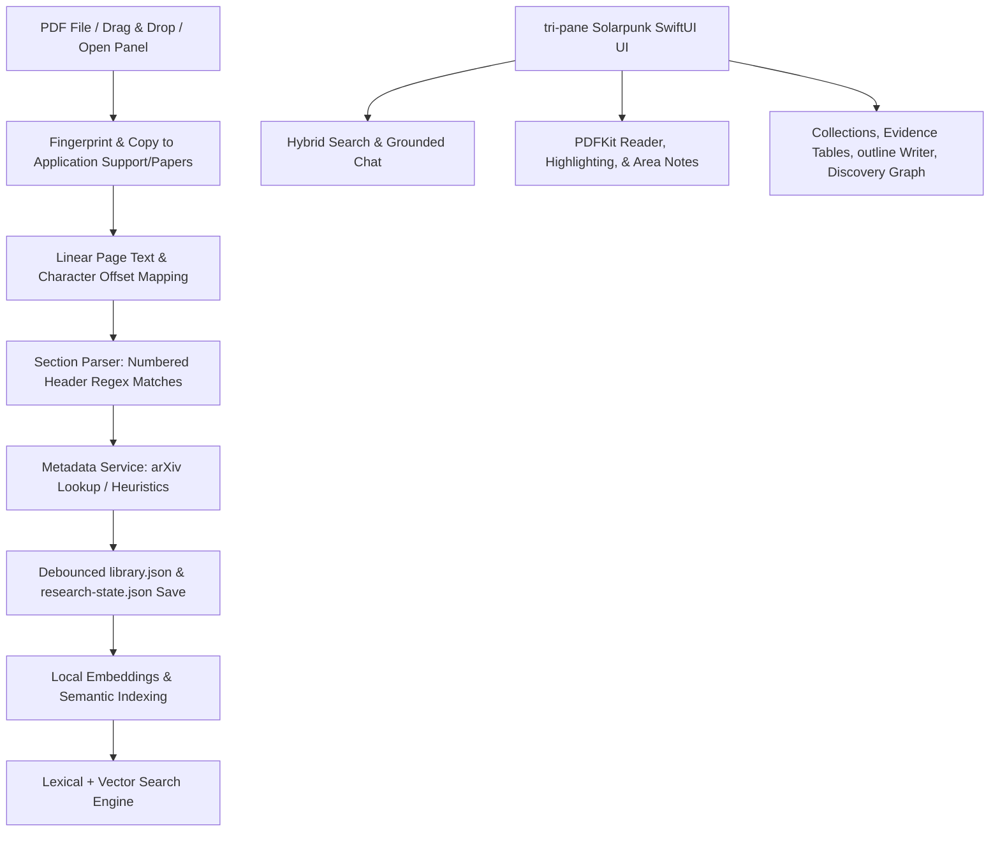

# Research Paper Reader — System & Architectural Detail

This document provides a comprehensive, bottom-up detail of the **Research Paper Reader** macOS application. It covers product vision, system architecture, data models, core processing pipelines, UI/UX mechanics, file layouts, and testing patterns.

---

## 1. Product Overview & Architecture

The Research Paper Reader is a **local-first, AI-optional, Apple-native macOS application** designed for graduate students, academic researchers, and technical readers who need to digest dense scientific literature. 

### Core Architectural Principles
1. **Local-First Persistence**: All user documents, metadata, notes, and research states are stored directly on the user's local machine in Application Support. No external server, database, or network login is required.
2. **AI-Optional Routing**: Deep reading, annotations, outline building, and search function fully offline. If local model routing (such as Apple Foundation Models or Core ML) is available, the app leverages on-device accelerators. Otherwise, it falls back to deterministic, local heuristic string-processing.
3. **Structured Context & Traceability**: The application decomposes static PDF files into rich, structured "Research Objects" with page-mapped text offsets, annotations, and metadata. AI-generated answers are grounded in specific character ranges and page numbers, enabling direct source verification.

### System Data Flows



---

## 2. Data Models & Schema Design

The application divides its persistence model into two distinct, backward-compatible JSON storage engines to keep the core library schema clean:
- **`library.json`**: Backed by `Paper` and handles document metadata, raw text, offsets, sections, and individual highlights/notes.
- **`research-state.json`**: Backed by `ResearchState` and handles cross-paper structures such as Collections, Smart Folders, Evidence Workspace tables, writing projects, and OpenAlex topic alerts.

### 2.1 Core Document Models (`library.json`)

#### `Paper`
The root representation of an ingested document.
* **`id`** (`UUID`): Unique identifier.
* **`documentKind`** (`DocumentKind`): Enum representing `.researchPaper`, `.lectureSlides`, `.studyNotes`, `.bookChapter`, or `.generalPDF`.
* **`title`**, **`authors`**, **`year`**, **`venue`**, **`abstract`** (`String`): Extracted/enriched metadata.
* **`doi`**, **`arxivId`**, **`publicationNumber`** (`String`): Normalized identifier strings used for deduplication and online discovery queries.
* **`filePath`** (`String`): Path to the copied PDF in the app's local sandbox directory.
* **`importedAt`** (`Date`): Ingestion timestamp.
* **`status`** (`ReadingStatus`): Enum tracking reading states: `.unread`, `.skimmed`, `.reading`, `.read`, `.cited`, `.rejected`, `.archived`.
* **`tags`** (`[String]`): User-defined tags.
* **`sections`** (`[PaperSection]`): List of detected structural elements.
* **`notes`** (`[PaperNote]`): Visual highlights and typed notes.
* **`allText`** (`String`): The complete extracted text of the PDF, used for full-text search, summarization, and embeddings.
* **`allTextPageOffsets`** (`[Int]`): Character indices marking the start of each page, enabling character-to-page resolution.
* **`lastReadPage`** (`Int?`), **`lastReadAt`** (`Date?`): Used for resuming reading location.

#### `PaperSection`
* **`id`** (`UUID`): Section identifier.
* **`kind`** (`SectionKind`): Categorizes the section (e.g., `.abstract`, `.introduction`, `.method`, `.results`, `.references`, `.appendix`, `.other`).
* **`title`** (`String`): Header text.
* **`text`** (`String`): Raw body text content.
* **`order`** (`Int`): Ordering inside the document.
* **`page`** (`Int?`): The 1-based PDF page index where the section header is located.

#### `PaperNote`
Represents both standard text selections and rectangular area notes (captures of figures/equations).
* **`id`** (`UUID`): Note identifier.
* **`kind`** (`HighlightKind`): Highlights categorized as `.highlight`, `.claim`, `.evidence`, `.method`, `.limitation`, `.question`, or `.definition`. Matches specific colors.
* **`quote`** (`String`): Selected text from the PDF.
* **`body`** (`String`): User's typed margin note.
* **`page`** (`Int?`): 1-based page index.
* **`createdAt`** (`Date`): Note creation timestamp.
* **`isAreaNote`** (`Bool`): Flags whether the note represents a cropped image/coordinate bounding box.
* **`rectX`**, **`rectY`**, **`rectWidth`**, **`rectHeight`** (`Double?`): Normalized coordinate bounds on the PDF page.
* **`imageFileName`** (`String?`): Filename of the saved high-resolution PNG crop stored in the app's local images directory.

---

### 2.2 Cross-Paper & Synthesis Models (`research-state.json`)

#### `ResearchState`
The master container wrapper for cross-document features.
* **`collections`** (`[PaperCollection]`): Manual nested folder groupings.
* **`smartFolders`** (`[SmartFolder]`): Automated query folders matching compound rules.
* **`evidenceTables`** (`[EvidenceTable]`): Structural tables comparing fields across multiple papers.
* **`workspaces`** (`[SynthesisWorkspace]`): Drafting projects combining outlines and citation keys.
* **`citations`** (`[CitationRecord]`): Discovered or manually imported bibliographic items.
* **`alerts`** (`[ResearchAlert]`): Saved author or topic search monitors checking against OpenAlex.
* **`recommendedPapers`** (`[RecommendedPaper]`): External recommendations generated from library neighbors.
* **`hiddenRecommendations`** (`Set<String>`): Discovered paper IDs marked as rejected.

#### `SmartFolder`
* **`id`** (`UUID`), **`name`** (`String`), **`matchAll`** (`Bool`).
* **`rules`** (`[SmartFolderRule]`): Individual checks mapping across title, author, tag, venue, year, document kind, reading state, annotation text, or document full text.

#### `EvidenceTable`
* **`id`** (`UUID`), **`name`** (`String`), **`columns`** (`[String]`): Configurable column names.
* **`rows`** (`[EvidenceRow]`): Grid rows maps.
  * Each `EvidenceRow` binds a `paperID` (`UUID`) and matches column names to specific values.
  * Cell values are represented as `EvidenceCell`: contains `text` (`String`), `pageNumber` (`Int?`), `quote` (`String`), and `isVerified` (`Bool`).

---

## 3. Core Processing Pipelines

```
[Imported PDF] ➔ [Extract Raw Text & Offsets] ➔ [Identify Structural Sections] ➔ [Fetch Online Metadata]
```

### 3.1 PDF Ingestion & Character Mapping
When a document is selected or dropped:
1. The app computes a SHA-256 fingerprint of the PDF file to prevent duplicate files.
2. The file is copied to `<Application Support>/ResearchPaperReader/Papers/<UUID>.pdf`.
3. The raw text is extracted page-by-page. For each page, the app tracks the starting character index inside the cumulative `allText` buffer, saving these boundaries in `allTextPageOffsets`. This allows any sub-string index matching in semantic search to immediately map back to a physical page number.

### 3.2 Structural Section Parser
The section detector splits raw text using a two-pass line regex:
* **Numbered Header Pass**: Priority is given to lines matching standard academic structures like `1. Introduction`, `2.1 Background`, `III. Methodology`, or `A. Setup`.
* **Unnumbered Fallback**: Matches simple lines against known headers (`Abstract`, `Introduction`, `Related Work`, `Method`, `Experiments`, `Results`, `Discussion`, `Conclusion`, `References`, `Appendix`).
* Each matched line maps its text position to the page number using `allTextPageOffsets`. The text between consecutive headers is saved as the section's body text.

### 3.3 Metadata Enrichment Pipeline
On import, if the file is identified as a research paper, it passes through `MetadataService`:
1. **Identifier Extraction**: Scans the first page for DOI patterns (`10.xxxx/...`) and arXiv IDs (`arXiv:xxxx.xxxxx`).
2. **arXiv API Lookup**: If an arXiv ID is discovered, the service sends an HTTP request to the arXiv API. It parses the returned XML to retrieve the canonical title, authors list, year, abstract, and sets the venue to `"arXiv"`.
3. **Local AI/Heuristic Extraction**: If no identifiers are found, it falls back to heuristics (first line for title, second for authors, first 4-digit number in the first 5 lines for year, or uses Apple Foundation Models on macOS 15+ if enabled) to populate the fields.

### 3.4 Local Semantic Search & Hybrid Querying
* **Semantic Search**: Uses on-device sentence embeddings (processed via Apple's NaturalLanguage sentence embedding models) to index document paragraphs. The parser stops parsing pages once it hits the `References` or `Bibliography` sections to avoid indexing citation pages.
* **Lexical Fallback**: If vector models are unavailable, it falls back to tokenized keyword matching.
* **Hybrid Ranking**: Merges vector distances and token frequencies, presenting extractive answers formatted as page-linked markdown cards.

---

## 4. User Interface Architecture

The app is built entirely in **SwiftUI** with **AppKit integration** (using `NSViewRepresentable`) to support low-level PDF rendering. It utilizes Zotero-inspired structures with a custom **Solarpunk design language** (incorporating moss, fern, clay, and parchment colors).

```
+------------------------------------------------------------------------------------+
|  Toolbar: Navigation, Search, Zoom, Highlight Tools, Area Note Marquee, Hub Toggle  |
+-------------------------------------------------------------------+----------------+
|                                                                   |                |
|  Sidebar Navigation                                               |  Detail / PDF  |
|                                                                   |  Reader Pane   |
|  - Smart Folders                                                  |                |
|  - Collections                                                    |  - PDF View    |
|  - Filter & Sort                                                  |  - Scroll View |
|  - Paper List (Card Browser)                                      |  - Selected    |
|                                                                   |    Highlight   |
|                                                                   |    HUD popup   |
|                                                                   |                |
+-------------------------------------------------------------------+----------------+
|  Bottom Status: Import Progress Bar, Error/Warning Alert Banners                   |
+------------------------------------------------------------------------------------+
|  Research Hub (Modal Split Pane):                                                  |
|  [ Collections ]  [ Evidence Table ]  [ Chat ]  [ Outlines ]  [ Graph & Alerts ]   |
+------------------------------------------------------------------------------------+
```

### 4.1 Tri-Pane UI & Segments
1. **Primary Navigation Sidebar**: Contains search bars (300ms debouncing), status filters, Collections trees, and Smart Folders.
2. **Library Selection Grid / Shelf**: Displays documents as cards with color-coded status strips and reading progress indicators. Includes a "Continue Reading" shelf for in-progress papers.
3. **Reader Workspace split-pane**:
   * **Left (PDF Canvas)**: Employs an `NSViewRepresentable` wrapper around `PDFKit.PDFView`. Custom overlays capture mouse events for area note draws.
   * **Right (Collapsible Inspector)**: Multi-tab layout for Notes (color-coded picker swatches, lists, Markdown exports) and AI (collapsible summary and explanation boxes).

### 4.2 PDF Area Notes & Bounding Coordinate Mechanics
* When the Area Note marquee tool is selected, the custom `CropPDFContainerView` places a mouse-tracking overlay above the active `PDFView`.
* During drag, a blue-bordered bounding box renders. On mouse up, the selected region is rendered to a high-resolution PNG image and saved to the local database under `Images/<UUID>.png`.
* The coordinates are stored as normalized percentage multipliers of the page's boundaries (`rectX`, `rectY`, `rectWidth`, `rectHeight`). This ensures highlights scale dynamically when zooming or resizing the PDF window. Clicking an area note instructs the coordinator to calculate the target rect and call `pdfView.go(to: rect, on: page)`.

---

## 5. Codebase Directory Map

```
Sources/ResearchPaperReader/
├── ResearchPaperReaderApp.swift   # App lifecycle, main menu, keyboard shortcuts, Settings view wiring
├── WindowBoundsEnforcer.swift     # Restricts window sizing via NSWindow.minSize bindings
├── SolarpunkTheme.swift           # Hex and asset styling variables (moss, fern, lichen, clay, parchment)
│
├── ContentView.swift              # Master split view container; animates card grid to reader transitions
├── SelectionScreen.swift          # Card grid browser, sort picker (Recent/Title/Author/Year), progress shelf
├── SettingsView.swift             # Grouped settings: reading, alert intervals, and AI modes
│
├── Models.swift                   # Structs for Paper, PaperSection, PaperNote; includes sort/filter extensions
├── PaperStore.swift               # Observable main store; handles JSON serialization and debounced disk saving
│
├── PDFReaderView.swift            # NSViewRepresentable wrapper of PDFView, hover HUD tooltips, zoom, and go-to-page
├── ReaderWorkspace.swift          # HSplitView holding PDF reader and Collapsible Notes/AI sidebar panels
├── MarkdownResultView.swift       # Standardized markdown rendering panel for AI summaries and chat results
│
├── LocalPaperAI.swift             # Main router for LLM extraction, explain-selection, and summaries
├── MetadataService.swift          # Parses DOIs/arXiv keys; calls arXiv API; falls back to local heuristics
│
├── ResearchModels.swift           # Model schemas for Collections, Evidence Tables, Outlines, Graphs, and Alerts
├── ResearchServices.swift         # Logic for BibTeX/RIS, semantic indexing, OpenAlex Discovery, and Graph extraction
├── DiscoveryNotificationService.swift # Sends desktop alerts/banners for incoming research matches
├── ResearchHubView.swift          # Segments Research Hub workspace tabs: tables, writing, graphs, alerts
└── EvidenceWorkspaceView.swift    # Spreadsheet comparisons, inline cell editing, and table exports
```

---

## 6. Testing & Validation Suite

The project includes structural and functional tests inside `Tests/ResearchPaperReaderTests/`:

### 6.1 Data Model & Serialization (`ModelStabilityTests.swift`)
* **`legacyLibraryEntriesDefaultToResearchPaper()`**: Verifies that when old library structures (with no document kind) are deserialized, they default to `.researchPaper`.
* **`documentKindSurvivesPersistenceRoundTrip()`**: Assures `DocumentKind` enums serialize and deserialize cleanly without loss.
* **`pendingFullTextDebounceDoesNotMatchEveryDocument()`**: Validates that paper changes trigger debounced saves only for modified records rather than whole-library disk writing.
* **`markdownResultsParseIntoStructuredBlocks()`**: Validates structured markdown parsing helper routines.
* **`readingProgressIsBackwardCompatibleAndMarksWorkInProgress()`**: Confirms reading percentages are calculated correctly and auto-progress from `unread` to `reading`.
* **`paperTagsAndNotesModificationWorks()`**: Verifies tag insertions, modifications, and note changes persist accurately.
* **`areaNotesSurviveSerializationRoundTrip()`**: Validates coordinates (`rectX`, `rectY`, etc.) and image filenames remain intact.
* **`legacyTextNotesDefaultAreaFields()`**: Ensures note decoders safely default missing fields when loading legacy JSON formats.
* **`documentKindInferenceWorks()`**: Validates regex rules and keyword matching for inferring document categories from extracted text.

### 6.2 Application Logic & Workflows (`ResearchFeatureTests.swift`)
* **`researchFeaturesPersistTogetherAndDeletionCleansReferences()`**: Verifies workspace links, alerts, and tables write to a single `research-state.json` file and deletion cleans orphaned items.
* **`researchStateDefaultsMissingFieldsForForwardMigration()`**: Confirms older schema files are automatically upgraded with new fields upon deserialization.
* **`smartFoldersCombineRulesWithoutChangingPapers()`**: Assures composite smart folder matches (combining tags, authors, status rules) evaluate dynamically without writing modifications.
* **`bibTeXAndRISRoundTripAndDeduplicateByDOI()`**: Exercises BibTeX/RIS importing and checks duplicate DOI resolving.
* **`evidenceTableRetainsPaperAnchorsAndBuildsCitedOutline()`**: Checks that adding papers to tables preserves exact cell source coordinate links when outlines are generated.
* **`evidenceTablesPopulateProvenanceAndDeduplicateAddedSources()`**: Verifies that adding papers to tables seeds columns, extracts citation keys, and retains source anchors.
* **`semanticSearchReturnsGroundedPaperAndPage()`**: Validates sentences are parsed, vectorized, and returned with exact page numbers.
* **`semanticSearchExcludesReferenceSectionsAndBibliographyFallback()`**: Assures citation blocks are skipped to prevent reference list pollution in search results.
* **`semanticSearchStopsRawPageIndexingAtBibliographyHeading()`**: Validates the paragraph indexer halts indexing once a references section is detected.
* **`citationGraphLinksReferencesToLocalDOI()`**: Checks reference parsing matches DOIs already present in local documents.
* **`citationGraphLinksReferencesByTitleAndYearWithoutDOI()`**: Checks linking heuristic fallback when DOIs are missing.
* **`citationGraphRejectsFooterAddendumAndOrphanedAuthorFragments()`**: Ensures footer or stray parsed content is rejected from the parsed reference list.
* **`citationGraphReconstructsWrappedReferencesAndKeepsTheFullPublicationTitle()`**: Validates multi-line reference wrapping reconstruction.
* **`citationGraphDoesNotPromoteAmpersandAuthorContinuationsToTitles()`**: Assures text joining doesn't conflate subsequent author blocks as publications.
* **`citationGraphDoesNotTreatDocumentTailAsReferencesWithoutAHeading()`**: Prevents false references lists when no explicit bibliography heading exists.
* **`discoveryFeedbackPersistsAndDefaultsForOlderState()`**: Verifies recommended items handle persistent "not relevant" and "more like this" user feedbacks.
* **`discoveryProviderPayloadsDecodeIntoCommonResults()`**: Validates parsing and decoders of OpenAlex payloads.
* **`discoveryOnlineLinksAllOpenToArxivSearch()`**: Verifies that external/online links default to arXiv queries.
* **`discoveryArxivTitleQueriesRouteToArxiv()`**: Confirms formatted arXiv titles route cleanly to standard web landing pages.
* **`recommendedPapersSaveOncePersistAndCanBeRemoved()`**: Exercises discovery logic for candidate recommendations and deletions.
* **`alertsRejectInvalidDOIsAndDuplicateQueries()`**: Ensures OpenAlex query validations reject bad identifiers and catch duplicates.
